# Savings Goal Tracking System - Visual Flowchart

## How to View This Flowchart
1. Copy the Mermaid code below
2. Paste it into any of these tools:
   - GitHub (create/edit a .md file)
   - Mermaid Live Editor: https://mermaid.live/
   - VS Code with Mermaid extension
   - Many documentation platforms support Mermaid

## Mermaid Flowchart Code

```mermaid
flowchart TD
    A([🚀 START]) --> B[👤 User Login]
    B --> C{📝 Create New Goal?}
    
    C -->|Yes| D[📋 Enter Goal Details<br/>• Name<br/>• Target Amount<br/>• Target Date]
    C -->|No| E[👀 View Existing Goals]
    
    D --> F[💾 Save Goal to Database]
    F --> G[✅ Goal Created Successfully]
    G --> E
    
    E --> H{💰 Add Money to Goal?}
    
    H -->|Yes| I[📊 Update Progress Percentage]
    H -->|No| J[🔔 Check Notifications]
    
    I --> K{🎯 Goal Reached?}
    K -->|Yes| L[🎉 Success Message<br/>Goal Complete!]
    K -->|No| J
    
    J --> M{⚠️ Date Approaching<br/>& Goal Not Met?}
    M -->|Yes| N[📱 Send Warning<br/>Notification]
    M -->|No| O([🏁 END])
    
    N --> O
    L --> P{🔄 Create Another Goal?}
    P -->|Yes| C
    P -->|No| O
    
    style A fill:#e1f5fe
    style L fill:#c8e6c9
    style N fill:#ffcdd2
    style O fill:#f3e5f5
    style D fill:#fff3e0
    style I fill:#e8f5e8
```

## Simplified Process Overview

| Step | Action | Description |
|------|--------|-------------|
| 1 | **Login** | User authenticates into the app |
| 2 | **Create Goal** | Set savings target (name, amount, date) |
| 3 | **Track Progress** | Add money and monitor percentage |
| 4 | **Get Notifications** | Receive alerts when behind schedule |
| 5 | **Complete Goal** | Celebrate success and optionally create new goals |

## Key Decision Points
- ✅ **Create New Goal?** - Branch to goal creation or view existing
- ✅ **Add Money?** - Update progress or check notifications  
- ✅ **Goal Reached?** - Success celebration or continue tracking
- ✅ **Date Approaching & Not Met?** - Send warning or end process